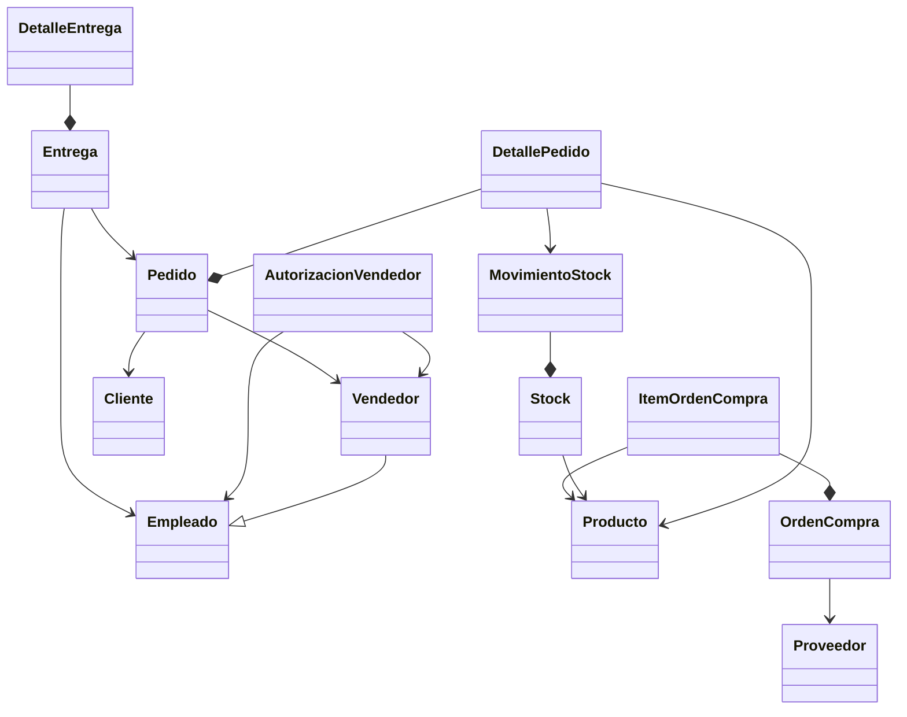

# PoliMarket

## 1. Contexto

PoliMarket opera con cinco areas de negocio: Recursos Humanos, Ventas, Bodega, Proveedores y Entregas.  
El flujo principal es:

1. RRHH autoriza vendedores.
2. Ventas crea y confirma pedidos para clientes.
3. Ventas y Entregas consultan Bodega para disponibilidad.
4. Bodega dispara reposicion a Proveedores cuando el stock baja del minimo.
5. Entregas programa y confirma la distribucion, registrando salidas de inventario.

---

## 2. Diagrama de clases UML (vista logica)

---

## 3. Tabla de componentes

| Area de negocio | Componente | Funcionalidades expuestas |
| --- | --- | --- |
| Recursos Humanos | ComponenteRRHH | `autorizarVendedor`, `revocarAutorizacion`, `verificarAutorizacion`, `listarVendedoresActivos` |
| Recursos Humanos | ComponenteEmpleados | `registrarEmpleado`, `actualizarEmpleado`, `getEmpleado`, `listarEmpleados` |
| Ventas | ComponenteVentas | `crearPedido`, `confirmarPedido`, `cancelarPedido`, `listarPedidosPorVendedor` |
| Ventas | ComponenteClientes | `registrarCliente`, `getCliente`, `listarClientes`, `getHistorialCompras` |
| Ventas | ComponenteCatalogo | `getProducto`, `listarProductos`, `buscarProducto`, `getPrecio` |
| Bodega | ComponenteStock | `verificarDisponibilidad`, `reducirStock`, `reponerStock`, `getStockActual` |
| Bodega | ComponenteMovimientos | `registrarSalida`, `registrarEntrada`, `getHistorialMovimientos` |
| Proveedores | ComponenteOrdenesCompra | `emitirOrdenCompra`, `emitirOrdenCompraPorProducto`, `confirmarRecepcion`, `listarOrdenesPendientes`, `getOrden` |
| Entregas | ComponenteEntregas | `programarEntrega`, `confirmarEntrega`, `getEstadoEntrega`, `listarEntregasPendientes` |
| Entregas | ComponenteLogistica | `asignarRepartidor`, `registrarSalidaBodega`, `getPedidosPorEntregar` |

---

## 4. Relaciones entre componentes

| Origen | Consume | Objetivo |
| --- | --- | --- |
| ComponenteVentas | IAutorizacion (equivalente) | ComponenteRRHH |
| ComponenteVentas | IStock (equivalente) | ComponenteStock |
| ComponenteStock | IOrdenesCompra (equivalente) | ComponenteOrdenesCompra |
| ComponenteEntregas | IMovimientos (equivalente) | ComponenteMovimientos |
| ComponenteEntregas | IPedidos (equivalente) | ComponenteVentas |

---

## 5. Cobertura de requerimientos funcionales

| Requisito | Implementacion en `app.py` |
| --- | --- |
| RF1 - Autorizar vendedor | `ComponenteRRHH.autorizarVendedor` y `verificarAutorizacion` bloqueando pedidos no autorizados |
| RF2 - Crear y confirmar pedido | `ComponenteVentas.crearPedido` + `confirmarPedido`, con calculo de total y cambio de estado |
| RF3 - Verificar disponibilidad de stock | `ComponenteStock.verificarDisponibilidad` usado por Ventas y Entregas |
| RF4 - Emitir orden de compra a proveedor | `ComponenteStock` dispara `ComponenteOrdenesCompra.emitirOrdenCompraPorProducto` bajo umbral minimo |
| RF5 - Programar y confirmar entrega | `ComponenteEntregas.programarEntrega` + `confirmarEntrega`, incluyendo salidas de bodega y cierre del pedido |

---
## 6 Clientes
 - Cliente 1  (Consola - Python)
 - Cliente 2 (Aplicación Web - Flask - Python)

## 6.1. Estructura final por carpetas (Clientes y compartida)

La solucion quedo separada por interfaz y con logica compartida:

- `app/src_shared/`  
  Clases, metodos y conexion a base de datos compartidos por consola y web.
  - `database.py`
  - `components.py`
  - `models.py`
  - `common.py`
  - `bootstrap.py`

- `app/src_consola/`  
  Interfaz de consola.
  - `app.py`
  - `console.py`

- `app/src_web/`  
  Interfaz web con Flask.
  - `app.py`
  - `templates/index.html`

La base de datos SQLite compartida por ambas aplicaciones:

`app/polimarket.db`

---

## 7 Ejecucion independiente de cada cliente

Instalar dependencias:

`py -3 -m pip install -r app/requirements.txt`

Ejecutar cliente de consola:

`py -3 app/src_consola/app.py`

Ejecutar cliente web Flask:

`py -3 app/src_web/app.py`

Luego abrir en navegador:

`http://127.0.0.1:5000`

---

## 8. Cobertura funcional en cliente web

La aplicacion Flask implementa los mismos RF:

- RF1: autorizar vendedor.
- RF2: crear y confirmar pedido.
- RF3: verificar disponibilidad de stock.
- RF4: confirmar recepcion de ordenes de compra (las ordenes se generan automaticamente cuando stock cae bajo minimo).
- RF5: programar y confirmar entrega.
